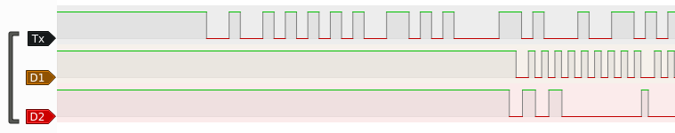
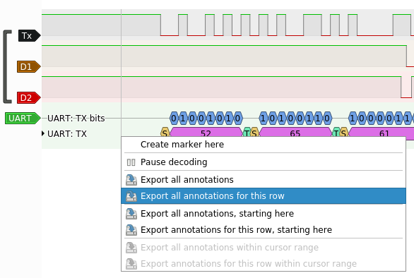
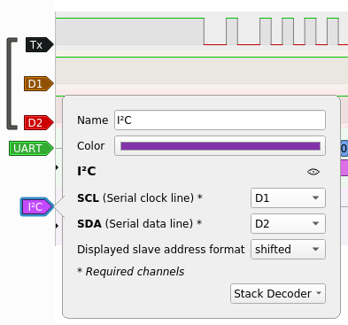
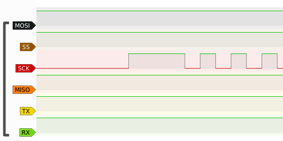
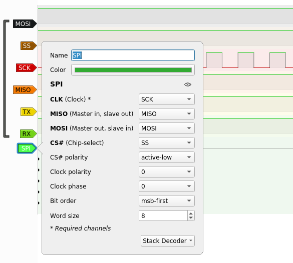

# Table of Contents
1. [Author](#Author)
2. [CTF](#CTF)
3. [Category](#Category)
4. [Challenge Name](#Challenge-Name)
5. [Challenge Points](#Challenge-Points)
6. [Attachments](#Attachments)
7. [Challenge Description](#Challenge-Description)
8. [Solution](#Solution)

# Author
0x534b aka m0n0

# CTF
Hacky Holidays 2022: Unlock the City

# Category
iot, hardware

# Challenge Name
Interfacing with the Hardware

# Challenge Points
Part 1: 50 pts
Part 2: 50 pts
Part 3: 75 pts

# Challenge Description
We found this router, I think contains information in order to unlock some district! We managed to sniff the traffic between the controller and the memory! Maybe we got something interesting!

Photo1: We identified the Tx, Rx, and GND, and we soldered 3 cables in order to connect it to our logic analyzer and capture the traffic from the UART port.\
Photo2: We connected our logic analyzer to the ports that Arduino uses for SPI and (virtual) UART, and captured the secret password! 

# Attachments
## Capture1.sr
Sigrok capture file:
```
Capture1.sr: Zip archive data, at least v2.0 to extract
```
## Capture2.sr
Sigrok capture file:
```
Capture2.sr: Zip archive data, at least v1.0 to extract
```
## Screenshot.png
A screenshot from Sigrok PulseView:

## photo1.png
An image of a cheap router (with a [funny story](https://www.businessinsider.com/anonabox-tor-wi-fi-router-could-be-fake-2014-10) behind it) hooked up to a logic analyzer.

## photo2.png
An image of what looks to be an Arduino Uno with an SD card shield like [this one](https://web.archive.org/web/20221022053301/https://www.walmart.ca/en/ip/2PCS-Data-Logger-Module-Logging-Shield-Data-Recorder-DS1307-for-Arduino-UNO-SD-Card/PRD51IUF7049G06), again wired up to another logic analyzer.


# Solution
## Part 1
Let's take a look at the first clue:
```
The first capture seems to contain 2 protocols. I think we tapped on the Tx of the UART port.
```

When we open up `Capture1.sr` in PulseView, it appears to be the same file as in the screenshot:\


According to the clue, we should be able to apply a UART decoder to the Tx signal:\


Then, we can export the data to a file that looks like this:
```
1369740-1369845 UART: TX: Start bit
1369844-1370678 UART: TX: 52
1370678-1370783 UART: TX: Stop bit
1370760-1370865 UART: TX: Start bit
1370864-1371698 UART: TX: 65
1371698-1371803 UART: TX: Stop bit
1371780-1371885 UART: TX: Start bit
1371884-1372718 UART: TX: 61
1372718-1372823 UART: TX: Stop bit
1372800-1372905 UART: TX: Start bit
1372904-1373738 UART: TX: 64
1373738-1373843 UART: TX: Stop bit
1373820-1373925 UART: TX: Start bit
1373924-1374758 UART: TX: 69
1374758-1374863 UART: TX: Stop bit
1374840-1374945 UART: TX: Start bit
1374944-1375778 UART: TX: 6E
...
```

If we decode the data transmitted as ASCII, we get this classic phrack phile:
```
Reading data from EEPROM : 
                               {=Phrack Inc.=}

                    Volume One, Issue 7, Phile 3 of 10

=-=-=-=-=-=-=-=-=-=-=-=-=-=-=-=-=-=-=-=-=-=-=-=-=-=-=-=-=-=-=-=-=-=-=-=-=-=-=-=
The following was written shortly after my arrest...

                       \/\The Conscience of a Hacker/\/

                                      by

                               +++The Mentor+++

                          Written on January 8, 1986
=-=-=-=-=-=-=-=-=-=-=-=-=-=-=-=-=-=-=-=-=-=-=-=-=-=-=-=-=-=-=-=-=-=-=-=-=-=-=-=

        Another one got caught today, it's all over the papers.  "Teenager
Arrested in Computer Crime Scandal", "Hacker Arrested after Bank Tampering"...
        Damn kids.  They're all alike.

        But did you, in your three-piece psychology and 1950's technobrain,
ever take a look behind the eyes of the hacker?  Did you ever wonder what
made him tick, what Forces shaped him, what may have molded him?
        I am a hacker, enter my world...
        Mine is a world that begins with school... I'm smarter than most of
the other kids, this crap they teach us bores me...
        Damn underachiever.  They're all alike.

        I'm in junior high or high school.  I've listened to teachers explain
for the fifteenth time how to reduce a fraction.  I understand it.  "No, Ms.
Smith, I didn't show my work.  I did it in my head..."
        Damn kid.  Probably copied it.  They're all alike.

        I made a discovery today.  I found a computer.  Wait a second, this is
cool.  It does what I want it to.  If it makes a mistake, it's because I
screwed it up.  Not because it doesn't like me...
                Or feels threatened by me...
                Or thinks I'm a smart ass...
                Or doesn't like teaching and shouldn't be here...
        Damn kid.  All he does is play games.  They're all alike.

        And then it happened... a door opened to a world... rushing through
the phone line like heroin through an addict's veins, an electronic pulse is
sent out, a refuge from the day-to-day incompetencies is sought... a board is
found.
        "This is it... this is where I belong..."
        I know everyone here... even if I've never met them, never talked to
them, may never hear from them again... I know you all...
        Damn kid.  Tying up the phone line again.  They're all alike...

        You bet your ass we're all alike... we've been spoon-fed baby food at
school when we hungered for steak... the bits of meat that you did let slip
through were pre-chewed and tasteless.  We've been dominated by sadists, or
ignored by the apathetic.  The few that had something to teach found us will-
ing pupils, but those few are like drops of water in the desert.

        This is our world now... the world of the electron and the switch, the
beauty of the baud.  We make use of a service already existing without paying
for what could be dirt-cheap if it wasn't run by profiteering gluttons, and
you call us criminals.  We explore... and you call us criminals.  We seek
after knowledge... and you call us criminals.  We exist without skin color,
without nationality, without religious bias... and you call us criminals.
You build atomic bombs, you wage wars, you murder, cheat, and lie to us
and try to make us believe it's for our own good, yet we're the criminals.

        Yes, I am a criminal.  My crime is that of curiosity.  My crime is
that of judging people by what they say and think, not what they look like.
My crime is that of outsmarting you, something that you will never forgive me
for.

        I am a hacker, and this is my manifesto.  You may stop this individual,
but you can't stop us all... after all, we're all alike.

                               +++The Mentor+++
_______________________________________________________________________________
Here's a flag for you CTF{460fb55e8ebca0bf21143d0b65fb6483}

Reading flag from EEPROM :
#Protip: did you do some hardware 'Wiresharking' here...
```

Including our first flag!


## Part 2
Time for the second clue:
```
We also tapped some wires mentioning SDA and SCL. No idea what this means.
```

As shown in the screenshot provided, this hints that we'll be decoding the other two signals with I2C next:\


Exporting the data here gives us a file like this:
```
1372485-1372485 I²C: Address/Data: Start
1373498-1373618 I²C: Address/Data: Write
1372658-1373498 I²C: Address/Data: Address write: 50
1373618-1373738 I²C: Address/Data: ACK
1373801-1374761 I²C: Address/Data: Data write: 00
1374761-1374881 I²C: Address/Data: ACK
1374937-1375897 I²C: Address/Data: Data write: 00
1375897-1376017 I²C: Address/Data: ACK
1376136-1376136 I²C: Address/Data: Stop
1376316-1376316 I²C: Address/Data: Start
1377328-1377448 I²C: Address/Data: Read
1376488-1377328 I²C: Address/Data: Address read: 50
1377448-1377568 I²C: Address/Data: ACK
1377618-1378578 I²C: Address/Data: Data read: 20
1378578-1378698 I²C: Address/Data: NACK
1378832-1378832 I²C: Address/Data: Stop
...
```

Decoding the reads, we get another copy of the hacker's manifesto, along with another flag:
```
                               {=Phrack Inc.=}

                    Volume One, Issue 7, Phile 3 of 10

=-=-=-=-=-=-=-=-=-=-=-=-=-=-=-=-=-=-=-=-=-=-=-=-=-=-=-=-=-=-=-=-=-=-=-=-=-=-=-=
The following was written shortly after my arrest...

                       \/\The Conscience of a Hacker/\/

                                      by

                               +++The Mentor+++

                          Written on January 8, 1986
=-=-=-=-=-=-=-=-=-=-=-=-=-=-=-=-=-=-=-=-=-=-=-=-=-=-=-=-=-=-=-=-=-=-=-=-=-=-=-=

        Another one got caught today, it's all over the papers.  "Teenager
Arrested in Computer Crime Scandal", "Hacker Arrested after Bank Tampering"...
        Damn kids.  They're all alike.

        But did you, in your three-piece psychology and 1950's technobrain,
ever take a look behind the eyes of the hacker?  Did you ever wonder what
made him tick, what Forces shaped him, what may have molded him?
        I am a hacker, enter my world...
        Mine is a world that begins with school... I'm smarter than most of
the other kids, this crap they teach us bores me...
        Damn underachiever.  They're all alike.

        I'm in junior high or high school.  I've listened to teachers explain
for the fifteenth time how to reduce a fraction.  I understand it.  "No, Ms.
Smith, I didn't show my work.  I did it in my head..."
        Damn kid.  Probably copied it.  They're all alike.

        I made a discovery today.  I found a computer.  Wait a second, this is
cool.  It does what I want it to.  If it makes a mistake, it's because I
screwed it up.  Not because it doesn't like me...
                Or feels threatened by me...
                Or thinks I'm a smart ass...
                Or doesn't like teaching and shouldn't be here...
        Damn kid.  All he does is play games.  They're all alike.

        And then it happened... a door opened to a world... rushing through
the phone line like heroin through an addict's veins, an electronic pulse is
sent out, a refuge from the day-to-day incompetencies is sought... a board is
found.
        "This is it... this is where I belong..."
        I know everyone here... even if I've never met them, never talked to
them, may never hear from them again... I know you all...
        Damn kid.  Tying up the phone line again.  They're all alike...

        You bet your ass we're all alike... we've been spoon-fed baby food at
school when we hungered for steak... the bits of meat that you did let slip
through were pre-chewed and tasteless.  We've been dominated by sadists, or
ignored by the apathetic.  The few that had something to teach found us will-
ing pupils, but those few are like drops of water in the desert.

        This is our world now... the world of the electron and the switch, the
beauty of the baud.  We make use of a service already existing without paying
for what could be dirt-cheap if it wasn't run by profiteering gluttons, and
you call us criminals.  We explore... and you call us criminals.  We seek
after knowledge... and you call us criminals.  We exist without skin color,
without nationality, without religious bias... and you call us criminals.
You build atomic bombs, you wage wars, you murder, cheat, and lie to us
and try to make us believe it's for our own good, yet we're the criminals.

        Yes, I am a criminal.  My crime is that of curiosity.  My crime is
that of judging people by what they say and think, not what they look like.
My crime is that of outsmarting you, something that you will never forgive me
for.

        I am a hacker, and this is my manifesto.  You may stop this individual,
but you can't stop us all... after all, we're all alike.

                               +++The Mentor+++
_______________________________________________________________________________ÿCTF{nt ott "tirTaki }
```

## Part 3
Now the final hint:
```
This smust be the lane between the controller and the memory. It probably contains the password!
```

Let's see `Capture2.sr`:\


From the names of the signals, and the hint pointing out that we are between the controller and the memory, it looks like an SPI bus. So, I decoded it with this setup:\


Then, exporting the MISO data, we get a file like this:
```
50143445-50144213 SPI: MISO data: FF
50144264-50145032 SPI: MISO data: FF
50145319-50146087 SPI: MISO data: FF
50146297-50147065 SPI: MISO data: FF
50147191-50147959 SPI: MISO data: FF
50148001-50148769 SPI: MISO data: FF
50148805-50149573 SPI: MISO data: FF
50149601-50150369 SPI: MISO data: FF
50150410-50151177 SPI: MISO data: 01
50151504-50152272 SPI: MISO data: FF
50152323-50153091 SPI: MISO data: FF
50153378-50154146 SPI: MISO data: FF
50154356-50155124 SPI: MISO data: FF
50155250-50156018 SPI: MISO data: FF
50156060-50156828 SPI: MISO data: FF
50156868-50157636 SPI: MISO data: FF
50157665-50158433 SPI: MISO data: FF
50158473-50159241 SPI: MISO data: 01
50159318-50160086 SPI: MISO data: 00
...
```

If we write these bytes into a file, we get what looks to be the contents of the flash disk from the picture:
```
00000000   FF FF FF FF  FF FF FF FF  01 FF FF FF  FF FF FF FF  FF 01 00 00  ....................
00000014   01 AA FF FF  FF FF FF FF  FF FF 01 FF  FF FF FF FF  FF FF FF 01  ....................
00000028   FF FF FF FF  FF FF FF FF  01 FF FF FF  FF FF FF FF  FF 00 FF FF  ....................
0000003C   FF FF FF FF  FF FF 00 C0  FF 80 00 FF  FF FF FF FF  FF FF FF 00  ....................
00000050   FF FF FF FF  FF FF FF FF  FF FF FF FF  FF FF FF FF  FF FF FF FF  ....................
00000064   FF FF FF FF  FF FF FF FF  FF FF FF FF  FF FF FF FF  FF FF FF FF  ....................
00000078   FF FF FF FF  FF FE FA 33  C0 8E D0 BC  00 7C 8B F4  50 07 50 1F  .......3.....|..P.P.
0000008C   FB FC BF 00  06 B9 00 01  F2 A5 EA 1D  06 00 00 BE  BE 07 B3 04  ....................
000000A0   80 3C 80 74  0E 80 3C 00  75 1C 83 C6  10 FE CB 75  EF CD 18 8B  .<.t..<.u......u....
000000B4   14 8B 4C 02  8B EE 83 C6  10 FE CB 74  1A 80 3C 00  74 F4 BE 8B  ..L........t..<.t...
000000C8   06 AC 3C 00  74 0B 56 BB  07 00 B4 0E  CD 10 5E EB  F0 EB FE BF  ..<.t.V.......^.....
000000DC   05 00 BB 00  7C B8 01 02  57 CD 13 5F  73 0C 33 C0  CD 13 4F 75  ....|...W.._s.3...Ou
000000F0   ED BE A3 06  EB D3 BE C2  06 BF FE 7D  81 3D 55 AA  75 C7 8B F5  ...........}.=U.u...
00000104   EA 00 7C 00  00 49 6E 76  61 6C 69 64  20 70 61 72  74 69 74 69  ..|..Invalid partiti
00000118   6F 6E 20 74  61 62 6C 65  00 45 72 72  6F 72 20 6C  6F 61 64 69  on table.Error loadi
0000012C   6E 67 20 6F  70 65 72 61  74 69 6E 67  20 73 79 73  74 65 6D 00  ng operating system.
00000140   4D 69 73 73  69 6E 67 20  6F 70 65 72  61 74 69 6E  67 20 73 79  Missing operating sy
00000154   73 74 65 6D  00 00 00 00  00 00 00 00  00 00 00 00  00 00 00 00  stem................
...
```

Searching the data for printable strings, we get:
```
$ strings miso.txt.out
Invalid partition table
Error loading operating system
Missing operating system
+j0|8IHC
DISK_IMG   FAT32   
8f@|
RRaAu
YZXr	@u
Invalid system disk
Disk I/O error
Replace the disk, and then press any key
IO      SYSMSDOS   SYS
WINBOOT SYS
SYSTEM~1   
TLTL
1000        
TLTL
1           
2           
3           
4           
5           
6           
7           
9           
10          
11          
TLTL
12          
TLTL
...
29          
TLTL
monkey
SYSTEM~1   
TLTL
1000        
TLTL
1           
2           
3           
4           
5           
6           
7           
9           
10          
11          
TLTL
12          
TLTL
13          
TLTL
...
61          
TLTL
basketball
```

Some of these strings don't quite fit in...

With some trial and error, the flag is: `CTF{monkeybasketball}`