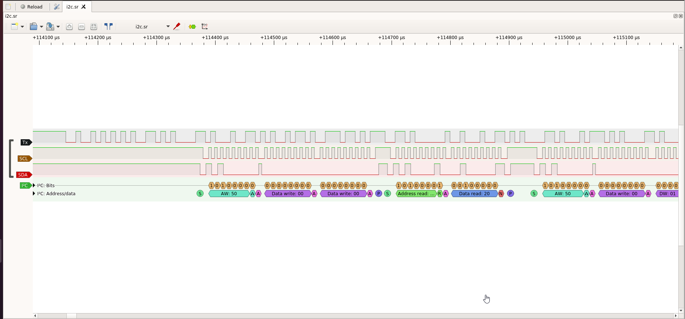

# Table of Contents
1. [Author](#Author)
2. [CTF](#CTF)
3. [Category](#Category)
4. [Challenge Name](#Challenge-Name)
5. [Challenge Points](#Challenge-Points)
6. [Attachments](#Attachments)
7. [Challenge Description](#Challenge-Description)
8. [Solution](#Solution)

# Author
0x534b aka m0n0

# CTF
Hacky Holidays 2022: Unlock the City

# Category
iot, hardware

# Challenge Name
Interfacing with the Hardware

# Challenge Points
Part 1: 50 pts
Part 2: 50 pts
Part 3: 75 pts

# Challenge Description
We found this router, I think contains information in order to unlock some district! We managed to sniff the traffic between the controller and the memory! Maybe we got something interesting!

Photo1: We identified the Tx, Rx, and GND, and we soldered 3 cables in order to connect it to our logic analyzer and capture the traffic from the UART port.
Photo2: We connected our logic analyzer to the ports that Arduino uses for SPI and (virtual) UART, and captured the secret password! 

# Attachments
## Capture1.sr
## Capture2.sr
## Screenshot.png

## photo1.png

## photo2.png

# Solution
