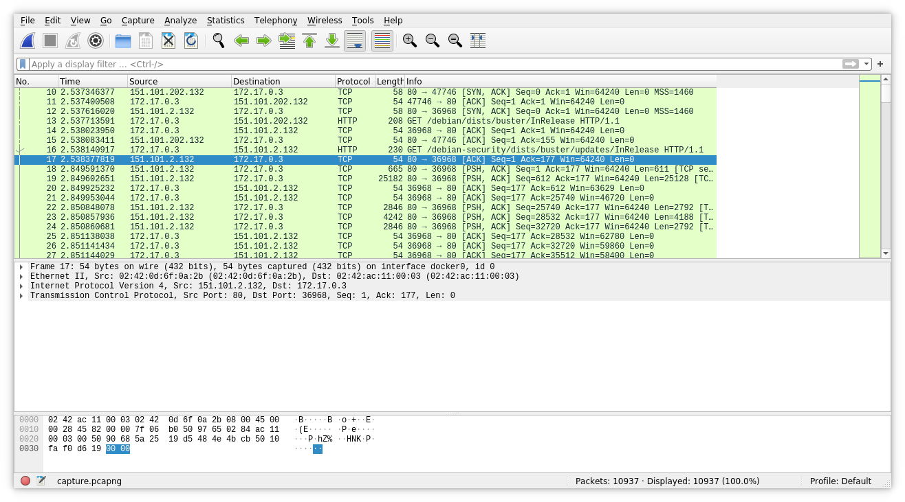
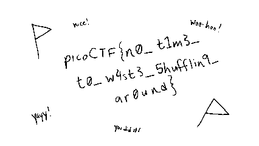

# Table of Contents
1. [Author](#Author)
2. [CTF](#CTF)
3. [Category](#Category)
4. [Challenge Name](#Challenge-Name)
5. [Challenge Points](#Challenge-Points)
6. [Attachments](#Attachments)
7. [Challenge Description](#Challenge-Description)
8. [Solution](#Solution)

# Author
0x534b aka m0n0

# CTF
picoMini by redpwn

# Category
Forensics

# Challenge Name
scrambled-bytes

# Challenge Points
200 pts

# Challenge Description
I sent my secret flag over the wires, but the bytes got all mixed up!

# Attachments
## capture.pcapng
A `pcapng` packet dump file, presumably containing the flag in some form.
```
./capture.pcapng: pcapng capture file - version 1.0
```

## send.py
A python script which, going by the challenge description and the name of the file (`send.py`), was used to send the flag over the network:
```py
#!/usr/bin/env python3

import argparse
from progress.bar import IncrementalBar

from scapy.all import *
import ipaddress

import random
from time import time

def check_ip(ip):
  try:
    return ipaddress.ip_address(ip)
  except:
    raise argparse.ArgumentTypeError(f'{ip} is an invalid address')

def check_port(port):
  try:
    port = int(port)
    if port < 1 or port > 65535:
      raise ValueError
    return port
  except:
    raise argparse.ArgumentTypeError(f'{port} is an invalid port')

def main(args):
  with open(args.input, 'rb') as f:
    payload = bytearray(f.read())
  random.seed(int(time()))
  random.shuffle(payload)
  with IncrementalBar('Sending', max=len(payload)) as bar:
    for b in payload:
      send(
        IP(dst=str(args.destination)) /
        UDP(sport=random.randrange(65536), dport=args.port) /
        Raw(load=bytes([b^random.randrange(256)])),
      verbose=False)
      bar.next()

if __name__=='__main__':
  parser = argparse.ArgumentParser()
  parser.add_argument('destination', help='destination IP address', type=check_ip)
  parser.add_argument('port', help='destination port number', type=check_port)
  parser.add_argument('input', help='input file')
  main(parser.parse_args())

```

# Solution
The first thing I did with this challenge, as with most forensics challenges involving network captures, was to examine it (`capture.pcapng`) in `wireshark`.


The first thing I noticed was that the file was full of TCP traffic: \


I followed a couple streams and it looked like the TCP traffic was a bunch of HTTP requests. I used wireshark's 'Export Object' function to look at the HTTP objects, and this showed that most of this traffic consisted of `deb` file downloads from debian.org. My guess is that they performed some software updates while sending the flag, and that these are not important.

Next, I took a look at `send.py` so that I could get a better idea of what I should be looking for in the packet capture.

First, it takes three arguments: a destination IP address and port number, as well as the path to the file containing the data to send.
```py
parser = argparse.ArgumentParser()
parser.add_argument('destination', help='destination IP address', type=check_ip)
parser.add_argument('port', help='destination port number', type=check_port)
parser.add_argument('input', help='input file')
```

Next, it passes those arguments on into this `main` function:
```py
def main(args):
  # read the input file into payload
  with open(args.input, 'rb') as f:
    payload = bytearray(f.read())

  # seed a pseudorandom number generator with the time
  random.seed(int(time()))

  # randomly shuffle the bytes of the payload
  random.shuffle(payload)

  # display a loading bar in the command line
  with IncrementalBar('Sending', max=len(payload)) as bar:
    # go through each byte of the payload
    for b in payload:
      # XOR the byte with a random byte, then send it from a random port number to the given destination via UDP
      send(
        IP(dst=str(args.destination)) /
        UDP(sport=random.randrange(65536), dport=args.port) /
        Raw(load=bytes([b^random.randrange(256)])),
      verbose=False)
      bar.next()
```

Using this information, I filtered the packets in wireshark down to just the UDP protocol. Within these, I found that most of them shared a common source and destination IP address, had the same destination port number, and had content of length 1. These seemed to be the packets I was looking for. So, I used the CLI tool `tshark` to filter these packets out and save them into their own file (`relevant.pcapng`):
```
tshark -r ./capture.pcapng -Y "udp && ip.src == 172.17.0.2 && ip.dst == 172.17.0.3 && \!icmp" -w relevant.pcapng
```

After making sure that this file contained all of the relevant packets, I used `tshark` once again to extract the one byte of data from each, and saved all of that to a file:
```
tshark -r ./relevant.pcapng -T fields -e data
```

Next, I would need to write a script to unscramble the data. This involved a few important points:
- The random number generator in the original script was seeded with the time, but only to the second: `random.seed(int(time()))`. So, the arrival time for the first packet should be close enough of an approximation to get the same seed (if not, I could subtract a few seconds until it works).
- Two packets (packets 434 and 1700) were corrupted somehow in transmission. However, their one byte of data (the byte in the same position in the packet as the data bytes for the others) was still intact, and so I could read it out from wireshark.

Here is the final script:
```py
import random
import subprocess

# from packet 1
arrival_time = 1614044650.913789387

data = None

# read my data extracted from wireshark
with open('flagdata', 'r') as f:
    data = f.read()

# remove newlines
data = bytearray([int(d, 16) if d != '' else 0 for d in data.split('\n')])

# manually deal with malformed packets
data[434-1] = 0x23
data[1700-1] = 0x0f

random.seed(int(arrival_time))

# create a known array and shuffle it to create a mapping to reverse the shuffle
control = [i for i in range(len(data))]
random.shuffle(control)

decoded = bytearray([0 for i in range(len(data))])

# go through each byte of data
for i in range(len(data)):
    # generate a number for the port, for two reasons:
    #   1. so I can check them against those in wireshark
    #   2. to keep the random number generation in the same order as in send.py
    port = random.randrange(65536)

    # apply the same XOR as in send.py (it is its own inverse) and de-shuffle
    decoded[control[i]] = data[i]^random.randrange(256)

# write the decoded data out to a file
with open('decoded', 'wb') as f:
    f.write(decoded)
```

After running this, I used the `file` command to check what kind of data was contained in the output file:
```
./decoded: PNG image data, 426 x 240, 1-bit grayscale, non-interlaced
```

Since it looks like a `png` file, I renamed it to `decoded.png` and viewed it:


And theres the flag!
```
picoCTF{n0_t1m3_t0_w4st3_5hufflin9_ar0und}
```